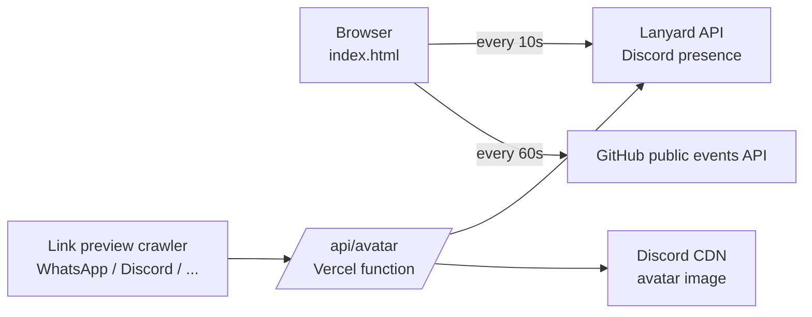

<div align="center">

# 🟢 discord-status-web

**A live, always-up-to-date page that shows what I'm doing right now** — my Discord status, what I'm listening to on Spotify, and my latest GitHub push, all on a glassy full-screen video background.

[](https://discord-status-web-topaz.vercel.app/)
[](https://vercel.com)


</div>

---

## ✨ Features

- **Live Discord presence** — Online / Idle / Do Not Disturb / Offline, with a colored status dot on the avatar and a glass pill in the top-left corner. Refreshes every 10 seconds.
- **Avatar + avatar decoration** — pulls your current Discord profile picture and renders your decoration (the dragon wings) on top of it.
- **Spotify card** — shows the song, artist and album art you're listening to, with a live progress bar that ticks every second.
- **Rich Presence** — games and other Discord activities show up in the same card.
- **GitHub push notification** — when you push, a card pops up showing **which repo and branch** you pushed to, then disappears again after **30 seconds**.
- **Full-screen video background** — with sound on by default (falls back to muted autoplay if the browser blocks it) and a mute/unmute button.
- **Liquid-glass UI** — iOS-style frosted glass buttons and cards, plus social links for Discord, GitHub and email.
- **Rich link previews** — sharing the URL on WhatsApp, Discord, Telegram, etc. shows your avatar and a title instead of a blank card.
- **Flicker protection** — the Spotify/activity card is kept on screen for a short grace period when Discord briefly drops presence data (for example during an Online → Idle change).

## 🧠 How it works

There is **no backend to run**. The page is a single static `index.html` that talks to public APIs straight from the browser.



| Piece | Source | Refresh |
| --- | --- | --- |
| Status, avatar, decoration, Spotify, activities | [Lanyard](https://github.com/Phineas/lanyard) (`api.lanyard.rest`) | every 10 s |
| Latest push / PR / issue | GitHub public events API | every 60 s (paused while the tab is hidden) |
| Link-preview image | `/api/avatar` serverless function | cached for 1 hour |

### Custom tag (`/tag`)

A small pill under the username (e.g. "📖 Reading", "🌱 Touching grass") that I change from my own Discord server with a slash command.

```
/tag preset:💻 Coding          pick from a list
/tag custom:on a train         type anything (max 40 characters)
/tag preset:✖ Clear tag        remove it
```

How it works: Discord sends the command to `api/discord.js` on Vercel, which checks Discord's signature, makes sure it's me, and saves the text into my [Lanyard KV](https://github.com/Phineas/lanyard) store under the key `tag`. The page already polls Lanyard every 10 seconds, so it picks the tag up from there. Because it lives in Lanyard, it shows even when I'm offline or invisible.

**Setup (one time):**

1. Create an app at the [Discord Developer Portal](https://discord.com/developers/applications). Copy the **Application ID** and **Public Key** from *General Information*.
2. Open the **Bot** tab and reset the token. Copy it once; Discord won't show it again.
3. DM the Lanyard bot `.apikey` to get a Lanyard API key.
4. In Vercel → Settings → Environment Variables, add `DISCORD_PUBLIC_KEY`, `DISCORD_APP_ID`, `DISCORD_BOT_TOKEN` and `LANYARD_API_KEY`, then redeploy.
5. Back in the Developer Portal, set **Interactions Endpoint URL** to `https://YOUR-SITE.vercel.app/api/discord`. Discord tests it when you save.
6. Invite the app to your server (*Installation* → Install Link, with the `applications.commands` scope).
7. Open `https://YOUR-SITE.vercel.app/api/setup-commands` once to register `/tag`. To change the preset list, edit `api/setup-commands.js` and open that URL again.

Only the Discord user ID set as `OWNER_ID` in `api/discord.js` can change the tag.

### The 30-second GitHub card

The card only shows an event while it is **less than 30 seconds old**, measured from the event's real timestamp on GitHub — not from when you opened the page. So opening the site an hour after a push shows nothing, and pushing while the page is open makes the card appear and then vanish on its own.

## 📁 Project structure

```
discord-status-web/
├── index.html          # the whole site: HTML, CSS and JS in one file
├── api/
│   ├── avatar.js       # Vercel function: serves your current Discord avatar as a PNG
│   ├── discord.js      # Vercel function: receives the /tag slash command from Discord
│   └── setup-commands.js  # one-time page that registers /tag with Discord
├── background-videos/  # drop your background videos here (any number of files)
│   └── YOUR_VIDEO_FILE.mp4
├── vercel.json         # bundles background-videos into the /api/videos function
└── README.md
```

## 🚀 Make it yours

1. **Join the Lanyard Discord server.** Lanyard only tracks users who are in its server — see the [Lanyard repo](https://github.com/Phineas/lanyard) for the invite. Without this the page shows an error.
2. **Fork or clone** this repo.
3. **Set your IDs** in `index.html`:
   ```js
   const DISCORD_USER_ID = "YOUR_DISCORD_ID";   // Discord → Settings → Advanced → Developer Mode, then right-click yourself → Copy User ID
   const GITHUB_USERNAME = 'your-github-name';
   ```
4. **Add your videos.** Put any number of `.mp4` / `.webm` / `.mov` files in the `background-videos/` folder. The page lists them automatically and plays them one after another, looping back to the first. No code changes needed.
5. **Update the link-preview tags.** In the `<head>` of `index.html`, change the `og:` / `twitter:` URLs to your own deployed domain, and set `DISCORD_USER_ID` again in `api/avatar.js`.
6. **Deploy.** Import the repo into [Vercel](https://vercel.com). There is no build command and no environment variables — it just works.

## ⚠️ Good to know

- **Public GitHub activity only.** The events API doesn't report pushes to private repos.
- **Rate limit.** GitHub allows 60 unauthenticated requests per hour per visitor. The page polls once a minute and backs off automatically if it gets rate-limited.
- **Link previews are cached.** WhatsApp and others remember the first preview they saw for a URL. To force a refresh, share the link with a query string like `?v=2`.
- **The dragon wings won't appear in link previews.** Avatar decorations are drawn on top of the avatar by the page and aren't part of the avatar image itself.
- **Sound autoplay.** Browsers usually block autoplay with sound until the visitor interacts, so the video may start muted — the button in the bottom-right turns sound on.

## 🙏 Credits

- [Lanyard](https://github.com/Phineas/lanyard) by Phineas — the API that makes Discord presence available to the web.
- Built and maintained by [@heyitsaadin](https://github.com/heyitsaadin).
